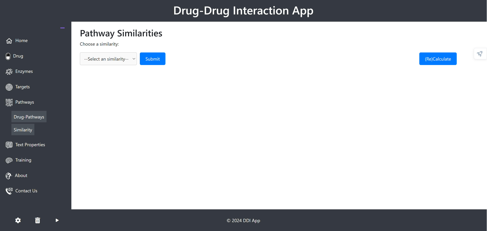

# Drug-Drug Interaction Prediction

This repository contains the code and resources for a machine learning model to predict drug-drug interactions, as detailed in my Persian thesis. The model uses a multi-modal deep learning architecture to combine structural, similarity, and textual drug data for improved prediction accuracy.
## Dataset
- Drug data sourced from DrugBank and KEGG databases
- 936 drugs and over 103,000 known drug-drug interactions
- Interactions classified into 65 types based on work by Ryu et al. (2018)
- MySQL backup: [Google Drive Link](https://drive.google.com/file/d/19y6AuItwCijTmAhRmFI8UoOHwVcIEIEK/view?usp=sharing)

## Model Architecture 
- Graph Attention Network (GAT) to process molecular structure graphs
- Multi-Layer Perceptrons (MLPs) to process drug similarity features
- SciBERT language model to extract features from textual drug data
- Final deep neural network to predict interaction type from combined drug representations

## Key Results
- 96.5% accuracy in 5-fold cross-validation scenario
- 70.9% accuracy when predicting interactions for new drugs
- 51.1% accuracy when predicting interactions between two completely new drugs
- Model outperforms baselines and state-of-the-art methods in all evaluation scenarios

## Repository Contents

- `data/`: Raw and preprocessed drug datasets
- `src/`: Source code for data preprocessing, model training, and evaluation
- `models/`: Trained model checkpoints
- `notebooks/`: Jupyter notebooks demonstrating model usage
- `README.md`: This file

## Setup
1. Clone the repository
2. Install required dependencies listed in `requirements.txt` 
3. Get MySQL backup: [Google Drive Link](https://drive.google.com/file/d/19y6AuItwCijTmAhRmFI8UoOHwVcIEIEK/view?usp=sharing)
4. Restore database
5. Set Configuration in `configs` 
6. Run

See the notebooks in `notebooks/` for examples of using the trained model to predict drug-drug interactions.

## Application Screenshots

*Target Similarities screen*

*Text Embedding screen*  

*SMILES Similarities screen*

 
*Enzyme Similarities screen*

*Pathway Similarities screen*

*Scheduled Trainings screen*

*Train screen*

*Training Compare screen*

## Citation

If you use this code or model in your research, please cite my thesis:

Hamid Tabatabaei. Predicting the drug interactions using deep learning methods. 
[Isfahan University of Technology](https://www.iut.ac.ir), 2025.

## Contact

For questions or collaboration inquiries, please contact Hamid Tabatabaei at [shamidtabtabaei@gmail.com](mailto:shamidtabtabaei@gmail.com)